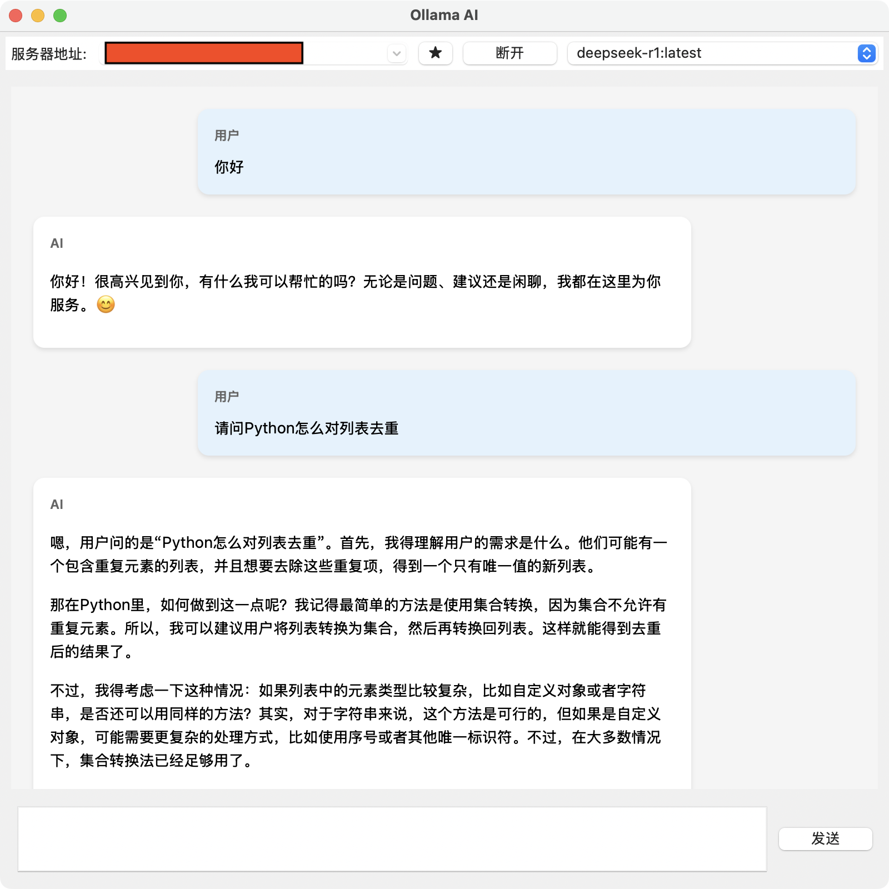

# Ollama AI Chat

基于Ollama服务的智能聊天应用，提供简洁优雅的聊天界面和丰富的模型支持。



## 功能特点

- 🚀 支持多种Ollama模型
- 💬 简洁直观的聊天界面
- 🔄 实时对话响应

## 安装说明

### 前置要求

- 已安装 Ollama 服务
- Python 3.10 或更高版本

### 安装步骤

1. 克隆项目
```bash
git clone https://github.com/jbpeople/ollama_ai_chat.git
cd ollama_ai
```

2. 安装依赖
```bash
pip install -r requirements.txt
```

3. 启动应用
```bash
python src/main.py
```

## 使用方法

1. 确保Ollama服务已在本地运行
2. 启动应用后，服务器地址输入框输入 `localhost:11434`
3. 选择想要使用的AI模型
4. 开始对话交互

### 配置文件说明

- `config.ini` 配置文件

```ini
[Server]
# 服务器地址
url = localhost:11434

[Chat]
# 聊天超时时间
timeout = 60.0

[Favorites]
# 收藏的服务器列表
servers = ["localhost:11434"]

[Window]
# 关闭窗口时的操作
close_action = ask
```


## 贡献指南

欢迎提交 Issue 和 Pull Request 来帮助改进项目。在提交之前，请确保：

1. Issue 描述清晰具体
2. Pull Request 包含完整的功能描述
3. 代码符合项目规范
4. 已添加必要的测试用例

## 许可证

本项目采用 MIT 许可证 - 详见 [LICENSE](LICENSE) 文件
